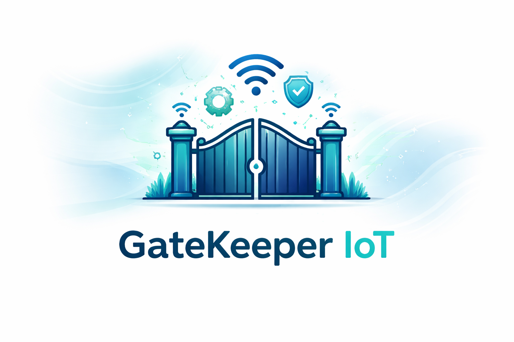
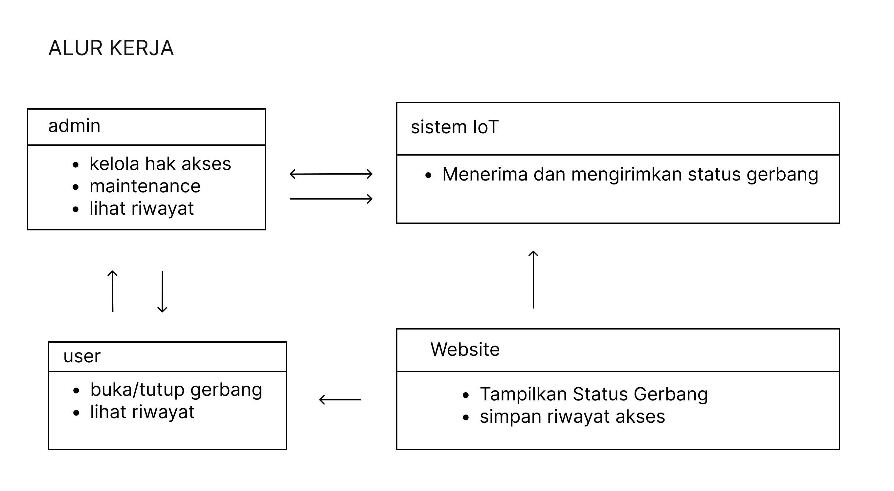
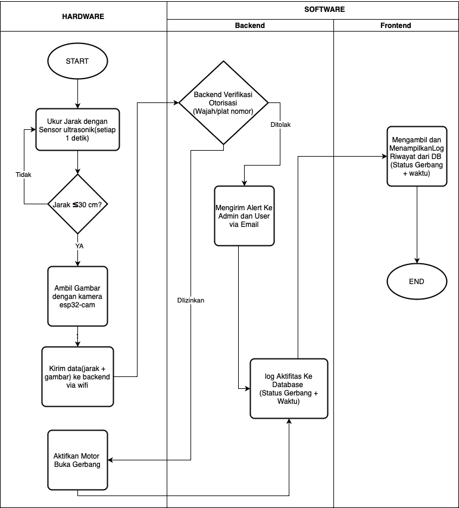

# GateKeeper IoT

**Smart Gate Monitoring & Scheduling System**

<p align="center">
  
  
  
  
  
</p>

<p align="center">
  
</p>

---

## 📌 Overview

GateKeeper IoT is a web-based IoT system designed to **monitor, control, and schedule gate operations** using an ESP32 microcontroller.  
The system is intended for **local or private deployment**, suitable for residential, campus, or industrial gate automation.

It combines:

- **Web dashboard** for monitoring & scheduling
- **Backend API** for authorization, logging, and automation
- **ESP32 hardware** for real-time gate control

---

## 🚀 Main Features

- Open / close gate remotely
- Gate open–close scheduling
- Real-time gate status monitoring
- Access history logging (timestamp & status)
- Unauthorized access detection (forced opening / RFID)
- Email alert notifications
- ESP32 integration with ultrasonic sensor & camera

---

## 🧩 System Architecture

### 1️⃣ High-Level Workflow



**Explanation:**

- **Admin** manages access rights, maintenance, and activity history.
- **User** can open/close the gate and view access logs.
- **Website** acts as a control panel and data visualizer.
- **IoT System (ESP32)** sends and receives gate status data.

---

### 2️⃣ Detailed Hardware–Backend–Frontend Flow



**Explanation:**

1. ESP32 measures distance using an ultrasonic sensor every second.
2. If distance ≤ 30 cm:
   - ESP32 captures an image using ESP32-CAM.
   - Distance data and image are sent to the backend via Wi-Fi.
3. Backend performs authorization verification (face / plate / schedule).
4. If authorized:
   - Gate motor is activated.
   - Activity is logged to the database.
5. If unauthorized:
   - Access is denied.
   - Alert is sent to admin/user.
6. Frontend retrieves and displays gate status and access history.

---

## 📄 Software Requirements Specification (SRS)

The complete **Software Requirements Specification (SRS)** document is included in this repository:

- 📂 Location: `assets/SRS_gate_1.0.pdf`
- 🗣 Language: **Indonesian**
- 📘 Contents:
  - System scope
  - Functional & non-functional requirements
  - Hardware & software specifications
  - Use cases and system flow

---

## 🛠 Technology Stack

### Frontend

- JavaScript / JSX
- React
- Tailwind CSS
- Axios

### Backend

- Node.js
- Express.js
- Sequelize ORM
- PostgreSQL
- MQTT
- bcryptjs

### Hardware

- ESP32 Gen 1
- Ultrasonic Sensor (HC-SR04)
- DC Motor + Motor Driver

---

## 📦 Deployment Architecture

| Component | Environment              |
| --------- | ------------------------ |
| Frontend  | Vercel                   |
| Backend   | VPS (Public IP required) |
| Database  | Docker Compose           |
| Hardware  | ESP32                    |

> For public deployment, only the frontend is deployed to Vercel.  
> Backend API runs on a VPS and is referenced via `vercel.json`.

---

## ⚙️ Local Development Setup

### 1️⃣ Clone Repository

```bash
git clone <repository-url>
cd gatekeeper-iot
```

### Environment Variables

- Copy .env.example → .env for:
- frontend/
- backend/

### Run Backed

```bash
cd backend
docker compose up -d
```

This will:

- Start backend service
- Initialize PostgreSQL
- Create database schema automatically

### Run Frontend

```bash
cd frontend
npm install
npm run dev
```

### 🔐 Security Notes

- JWT-based authentication
- Password hashing with bcrypt
- Recommended HTTPS for production
- Secure MQTT configuration advised

## License

[MIT](https://choosealicense.com/licenses/mit/)
